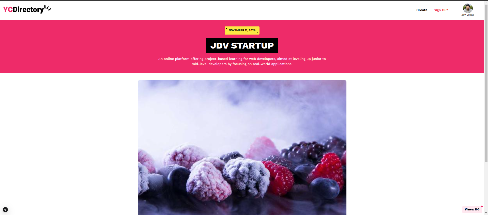
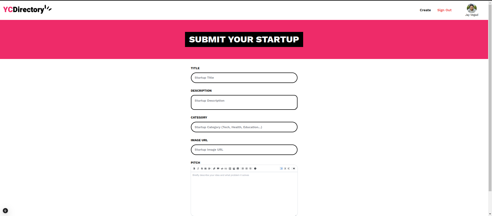

# Modern E-commerce Platform

A cutting-edge e-commerce solution built with Next.js, featuring a sleek Figma-inspired design, robust authentication, and modern development practices.


## Features

- 🎨 **Pixel-Perfect Design Implementation**
  - Carefully crafted UI components from Figma designs
  - Responsive layouts for all screen sizes
  - Custom animations and transitions
  - Hand-written CSS for unique components



- 🔐 **Advanced Authentication**
  - Secure user authentication with NextAuth.js
  - Social login providers integration
  - Protected routes and middleware
  - Role-based access control

- 📝 **Content Management**
  - Sanity CMS integration
  - Real-time content updates
  - Custom content types and schemas
  - Optimized media handling



- 🛠️ **Technical Features**
  - Form validation using Zod
  - SEO-friendly URLs with slugify
  - Server-side rendering and static generation
  - API route handlers
  - Typescript integration
  - Tailwind CSS for styling
  - Custom hooks and utilities

## Tech Stack

- **Frontend**: Next.js, React
- **Styling**: Tailwind CSS, Custom CSS
- **CMS**: Sanity.io
- **Authentication**: NextAuth.js
- **Validation**: Zod
- **Database**: Sanity's built-in database
- **Utilities**: slugify, various helper libraries

## Getting Started

1. Clone the repository:
```bash
git clone https://github.com/yourusername/project-name.git
```

2. Install dependencies:
```bash
npm install
```

3. Set up environment variables:
```env
NEXT_PUBLIC_SANITY_PROJECT_ID=your_sanity_project_id
NEXT_PUBLIC_SANITY_DATASET=production
NEXTAUTH_SECRET=your_nextauth_secret
NEXTAUTH_URL=http://localhost:3000
# Add other necessary environment variables
# Ensure your sanity is proper setuped
```

4. Run the development server:
```bash
npm run dev
```

## Project Structure

```
├── app/
│   ├── api/
│   ├── components/
│   ├── lib/
│   └── pages/
├── public/
├── sanity/
│   ├── schemas/
│   └── config/
├── styles/
└── types/
```

## Key Features Implementation

### Authentication Flow
- Custom NextAuth configuration with multiple providers
- Protected API routes and middleware
- Session management and persistence

### Content Management
- Sanity Studio integration
- Custom schemas for products, categories, and users
- Real-time content updates
- Image optimization and CDN delivery

### Form Handling
- Zod schemas for validation
- Custom form hooks
- Error handling and user feedback
- File upload integration

### Styling Approach
- Tailwind CSS for rapid development
- Custom CSS for unique components
- Responsive design principles
- Dark mode support

## API Routes

| Endpoint | Method | Description |
|----------|---------|-------------|
| `/api/auth/signin` | POST | NextAuth authentication endpoints |
| `/startup` | GET/POST | Startup Details |
| `/create` | GET/POST | Create Startups |

## Deployment

The project is configured for deployment on Vercel:

1. Connect your GitHub repository to Vercel
2. Configure environment variables
3. Deploy with built-in Next.js optimization

## Contributing

1. Fork the repository
2. Create your feature branch (`git checkout -b feature/AmazingFeature`)
3. Commit your changes (`git commit -m 'Add some AmazingFeature'`)
4. Push to the branch (`git push origin feature/AmazingFeature`)
5. Open a Pull Request

## License

This project is licensed under the MIT License - see the [LICENSE.md](LICENSE.md) file for details.

## Acknowledgments

- Design inspiration from Figma community
- Next.js team for the amazing framework
- Sanity.io for the powerful CMS
- All contributors and package maintainers
